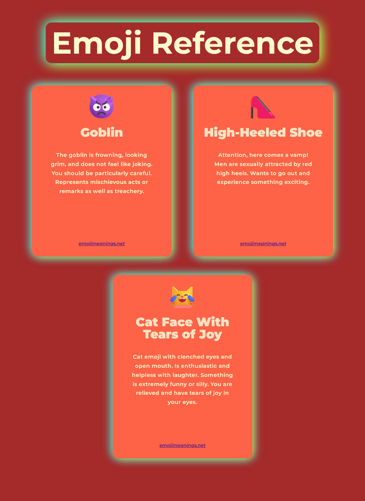
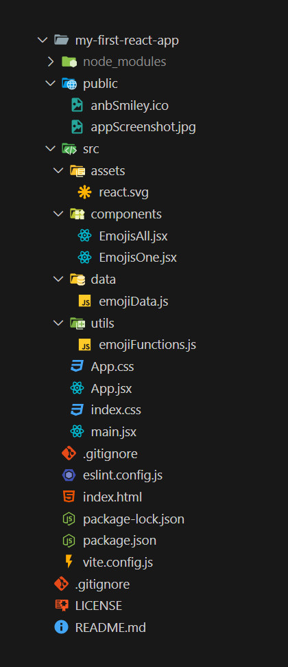

# **_myFirstReactApp_**

## **_Description:_**

My first React project: a simple webpage which shows descriptions of emojis. Based on, and extrapolated from, my solution to a lesson from Angela Yu's 'The Complete 2024 Web Development Bootcamp' on Udemy.

The foundation of this project/concepts are from Angela's course. My solution is based on my working through the problems and coming up with my own take, including new CSS styling.

Emojis are sourced from: [emojimeanings.net](https://www.emojimeanings.net/list-smileys-people-whatsapp).

Here's a screenshot of the webapp:



## **_Local React Setup/Installation:_**

#### **_Ensure `nvm`, `npm` and `node.js` are all up to date:_**

**Update npm (global)**:

```bash
npm install -g npm@latest
```

**Install and use the latest Node.js version**:

```bash
nvm install latest
nvm use <version_number>  # Example: nvm use 23.6.0
```

-   Create and navigate to new project folder `myFirstReactApp`.

```bash
npm create vite@latest my-first-react-app --template react
```

-   Select `React` then `JavaScript`. _(might be slightly different syntax...)_

```bash
cd my-first-react-app
npm install
npm run dev
```

**_Start React App:_**

```bash
cd ../myFirstReactApp/my-first-react-app
npm run dev
```

## **_Main Project Files:_**

I began with Angela's starter code and built my own solution, including a long array of emoji description objects, a favicon I made with [**_GIMP_**](https://www.gimp.org/) and a CSS color scheme.

Here's a look at the project files/directory:



_Andrew Blais_
